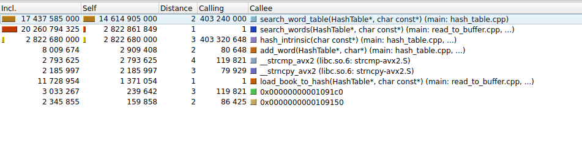

# Оптимизация хэш-таблицы
## 📌 Цель проекта
Разработка и оптимизация хеш-таблицы для строк с анализом эффективности различных хеш-функций и методов оптимизации.

## 🔍 Задачи

Оптимизировать критические функции, используя три метода:

- **Чистый ассемблер** — полная перезапись критических функций на ассемблере для максимального контроля над инструкциями процессора. 
- **Ассемблерные вставки** — механизм встраивания низкоуровневого ассемблерного кода в высокоуровневые языки.  
- **SIMD-инструкции** — векторизация вычислений через инструкции типа AVX/SSE для параллельной обработки данных.  

### Требования к оптимизации:
- Минимизировать объём ассемблерного кода.
- Оптимизировать до тех пор, пока прирост производительности >= 3-5 %
- Рассчитать коэффициент улучшения по формуле:  


## 🗃️ Хеш-таблица — структура данных 
###  🔍 Что это?
**Хеш-таблица** — структура для быстрого доступа к данным по ключу. Работает по принципу:
ключ → хеш-функция → индекс в массиве → значение

## Хеш-таблицы: Методы разрешения коллизий 🚀

В хеш-таблицах коллизии неизбежны. Вот два основных подхода к их разрешению:

### 1. Метод цепочек (Separate Chaining) 🔗

Каждая ячейка таблицы содержит указатель на начало связного списка. При совпадении хэшей новое слово добавляется в список.

#### ✅ Преимущества:
- Простота реализации.
- Устойчивость к высокому коэффициенту заполнения.

#### ❌ Недостатки:
- Дополнительные аллокации памяти.
- Cache misses при обходе списков.

### 2. Открытая адресация (Open Addressing) 🚪

Все элементы хранятся непосредственно в массиве. При коллизии происходит поиск следующей свободной ячейки.

#### ✅ Преимущества:
- Лучшая локальность данных.
- Меньше аллокаций.

#### ❌ Недостатки:
- Производительность падает при высоком заполнении (>70%).
- Сложнее реализовать удаление.

### 📊 Моя реализация:

Хэш-таблица основана на методе цепочек.

Размер таблицы: 5147 бакетов (простое число для равномерности).

Ключи: Строки до 32 символов .

Компилировать будем с флагом -O3.

## 🧪 Параметры окружения (WSL)

Все замеры производились в **WSL2 (Ubuntu 22.04)** на Windows 11.

### 🔧 Системные параметры

- **ОС**: Linux DESKTOP-LQJFIVQ 5.15.167.4-microsoft-standard-WSL2 x86_64 GNU/Linux
- **Процессор**: 12th Gen Intel(R) Core(TM) i5-12450H @ 2.60GHz
- **Количество ядер/потоков**: 12
- **Оперативная память (RAM)**: 7.6 GiB
- **Файловая система**: ext4 (на `/dev/sdc`, свободно 951 GB)

### Подготовка слов
Для начала уберем пунктуацию и переведем все буквы в строчные  отдельной программой [tools](tools/prepare_words.cpp).

## 🔥 Начнем искать горячие функции

 Воспользуемся valgrind для профилирования :


Колонка Incl. отражает количество тактов функциию, учитывая внутренние вызовы. Сортировку по этой колонке будем использовать для анализа функции поиска.
Для определения самой долгой функции будем ориентировать на колонку Self, которая показывает статистику тактов функций без внутренних вызовов.

Выбрав сортировку по Self, увидим, что больше всего тактов идет на функцию hash(), ее и будем оптимизировать.
### Первая оптимизация


```c
unsigned long hash(const char *key)
{
    assert(key);

    unsigned long hash = 5381;

    for (size_t i = 0; key[i] != '\0'; i++)

         hash = ((hash << 5) + hash) + (size_t) (key[i]); // hash * 33 + c


    return hash;
}
```

Для ускорения хэш-функции будем использовать  _mm_crc32_u64
[Hash function optimization ](source/hash_table.cpp#L29).
```c
uint32_t hash_intrinsic(const char* word)
{
    uint64_t hash = 0;
    hash = _mm_crc32_u64(hash, *((const uint64_t*)(word)));     //process only 4 byte
    hash = _mm_crc32_u64(hash, *((const uint64_t*)(word + 8)));
    hash = _mm_crc32_u64(hash, *((const uint64_t*)(word + 16)));
    hash = _mm_crc32_u64(hash, *((const uint64_t*)(word + 24)));
    return (uint32_t)hash;
}
```
Оценивать коэффициент ускорения будем по тактам работы функции без внутренних вызовов, по тактам работы функции поиска и времени работы функции поиска

🔍 Профилирование с Callgrind


| Функция       | До оптимизации (такты), 10^9 | После оптимизации (такты), 10^9 | Ускорение |
|---------------|------------------------|----------------------------|-----------|
| `hash()`      | ~17.4           | ~2.8                  | **6.21x** |
| `search_word_table()` | ~48.7        | ~34.5                 | **1.41x** |

 ⏱️ Сравнение по времени (clock_gettime)

| Метрика | До оптимизации | После оптимизации | Ускорение |
|---------|----------------|--------------------|-----------|
| **Среднее время** | 1.23 ± 0.04 сек | 0.94 ± 0.01 сек | **1.31x** |


### Вторая оптимизация


Теперь самая долгая strcmp, оптимизируем ее.
Для замены библиотечной функции strcmp на strcmp_avx2 с использованием интринсиков в prepare_words.cpp каждое слово сохраняется в памяти как 32-байтный блок (с дополнением нулями при необходимости). Это позволяет задействовать YMM-регистры для оптимизации.

[Implementation of Strcmp_avx2 function](source/hash_table.cpp#L89)
```c
__attribute__((noinline))

int strcmp_avx2(const char *s1, const char *s2)
{
    assert(s1);
    assert(s2);

    const __m256i *ptr1 = (const __m256i*)s1;
    const __m256i *ptr2 = (const __m256i*)s2;

    __m256i vec1 = _mm256_load_si256(ptr1);
    __m256i vec2 = _mm256_load_si256(ptr2);

    uint32_t mask = _mm256_movemask_epi8(_mm256_cmpeq_epi8(vec1, vec2));
    return (mask == 0xFFFFFFFF) ? 0 : 1;
}

```

🔍 Профилирование с Callgrind

| Функция       | До оптимизации (такты), 10^9 | После оптимизации (такты), 10^9  | Ускорение |
|---------------|------------------------|----------------------------|-----------|
| `strcmp()`      | ~15.8           | ~13.2                 | **1.19x** |
| `search_word_table()` | ~34.5         | ~30.4                  | **1.14x** |


 ⏱️ Сравнение по времени (clock_gettime)


| Метрика | До оптимизации | После оптимизации | Ускорение |
|---------|----------------|--------------------|-----------|
| **Среднее время** | 0.94±0.01 сек | 0.73±0.01 сек | **1.29x** |


### Третья оптимизация


Теперь самая долгая функция int search_word_table (HashTable *table, const char *word), оптимизируем ее интринсиками .


Функция до оптимизации:
```c

int search_word_table (HashTable *table, const char *word)
{

    assert(table);
    assert(word);

    unsigned long index = hash_intrinsic(word) % table->size;
    HashEntry *entry = table->buckets[index];

    while (entry)
    {
        if (strcmp_avx2(entry->word , word) == 0)
        {

            return entry->count;
        }

        if (entry->next)
            entry = entry->next;
        else
            break;
    }

    return HASH_NOT_FOUND_WORD;

}
```

Функция после оптимизации :
[Search_word_table function optimization](source/hash_table.cpp#L159)

```c
int search_word_table(HashTable *table, const char *word)
{
    assert(table);
    assert(word);

    unsigned long index = hash_intrinsic(word) % table->size;
    HashEntry *entry = table->buckets[index];

    // Подготавливаем искомое слово
    __m256i target = _mm256_loadu_si256((const __m256i *)word);

    while (entry)
    {
        // Загружаем слово и сравниваем
        __m256i current = _mm256_loadu_si256((const __m256i *)(entry->word));
        __m256i cmp = _mm256_cmpeq_epi8(current, target);
        int mask = _mm256_movemask_epi8(cmp);

        if (mask == 0xFFFFFFFF)
        {
            return entry->count;
        }

        entry = entry->next;
    }

    return HASH_NOT_FOUND_WORD;
}

```

🔍 Профилирование с Callgrind

| Функция       | До оптимизации (такты), 10^9 | После оптимизации (такты), 10^9  | Ускорение |
|---------------|-----------------------------|----------------------------------|-----------|
| `search_word_table()` | ~30.4             | ~15.9                      | **1.91x** |

Статистику по Self не будет, так так в Self добавилась функция strcmp_avx2. Анализ будет некорректным.


 ⏱️ Сравнение по времени (clock_gettime)

| Метрика | До оптимизации | После оптимизации | Ускорение |
|---------|----------------|--------------------|-----------|
| **Среднее время** | 0.73 ± 0.01 сек | 0.70 ± 0.01 сек | **1.04x** |

✅ Достижение целевого ускорения -  4х процентов. 
Но так как нам необходимо опробовать все методы в учебных целях, продолжаем оптимизировать.

### Четвертая оптимизация


Так как до сих пор функция  search_word_table(HashTable *table, const char *word) самая долгая, перепишем ее с ассмеблерной вставкой

[Search_word_table function optimization](source/hash_table.cpp#L188).
```c
int search_word_table(HashTable *table, const char *word)
{
    // Проверка входных параметров
    assert(table && word);

    // Вычисление хеш-индекса
    uint32_t index = hash_intrinsic(word) % table->size;
    HashEntry *entry = table->buckets[index];
    
    // Загрузка целевого слова в AVX регистр (1 раз перед циклом)
    const __m256i target = _mm256_loadu_si256((const __m256i*)word);

    while (entry)
    {
        uint32_t mask;  // Для хранения битовой маски сравнения
        uint8_t found;  // Флаг совпадения (0/1)

        /*
         * Ассемблерный блок с ручной оптимизацией:
         * 1. vmovdqu - загрузка текущего слова
         * 2. vpcmpeqb - векторное сравнение
         * 3. vpmovmskb - получение битовой маски
         * 4. Сравнение маски с 0xFFFFFFFF через регистр ECX
         * 5. sete - установка флага found
         */
        __asm__ __volatile__(
            "vmovdqu ymm0, [%[current]]\n\t"  // 1. Загрузка 32 байт из памяти
            "vpcmpeqb ymm0, ymm0, %[target]\n\t" // 2. Побайтовое сравнение
            "vpmovmskb %k[mask], ymm0\n\t"    // 3. Конвертация в битовую маску
            "xor %%ecx, %%ecx\n\t"            // 4.1 Обнуление ECX
            "not %%ecx\n\t"                   // 4.2 ECX = 0xFFFFFFFF
            "cmp %k[mask], %%ecx\n\t"         // 4.3 Сравнение маски
            "sete %[found]\n\t"               // 5. Установка флага
            : [mask] "=&r" (mask),
              [found] "=r" (found)
            : [current] "r" (entry->word),
              [target] "x" (target)
            : "ymm0", "ecx", "cc"  // Список разрушаемых регистров
        );

        if (found) {
            return entry->count;
        }

        entry = entry->next;
    }

    return HASH_NOT_FOUND_WORD;
}
```

🔍 Профилирование с Callgrind

| Функция       | До оптимизации (такты), 10^9  | После оптимизации (такты), 10^9 | Ускорение |
|---------------|-----------------------------|----------------------------------|-----------|
| `search_word_table()` |  ~15.9               | ~17.4                      | **0.91x** |


 ⏱️ Сравнение по времени (clock_gettime)

| Метрика | До оптимизации | После оптимизации | Ускорение |
|---------|----------------|--------------------|-----------|
| **Среднее время** | 0.70 ± 0.01 сек | 0.69 ± 0.01 сек | **1.01x** |

#### Причины возможного замедления

 1. Избыточные операции в ассемблерном блоке
- Использование последовательности `xor` + `not` для получения значения `0xFFFFFFFF` вместо прямого сравнения с константой
- Добавляет лишние инструкции, которые замедляют выполнение

 2. Неоптимальное использование регистров
- Вручную написанный ассемблер требует явного управления регистрами
- Компилятор может лучше оптимизировать распределение регистров при использовании интринсиков

В связи с неудачей вернемся к версии с интринсиками.

### Пятая оптимизация



Нам бы следовало переписать всю функцию search_word_table() на ассемблере, но для этого понадобилось бы очень много ассемблерных инструкций , которые бы уменьшили коэффициент улучшения значительно, в рамках учебных целей напишем функцию hash() на ассемблере в отдельном файле.

[Assembly implementation of hash function](asm/search_asm.asm).
```asm
hash_crc32_asm:
    xor     eax, eax
    crc32   rax, qword [rdi]    ; Обрабатываем 8 байт за раз
    crc32   rax, qword [rdi+8]
    crc32   rax, qword [rdi+16]
    crc32   rax, qword [rdi+24]
    ret
```
🔍 Профилирование с Callgrind

| Функция       | До оптимизации (такты), 10^9  | После оптимизации (такты), 10^9  | Ускорение |
|---------------|-----------------------------|----------------------------------|-----------|
| `search_word_table()` |  ~15.9             | ~17.9                    | **0.88x** |


 ⏱️ Сравнение по времени (clock_gettime)

| Метрика | До оптимизации | После оптимизации | Ускорение |
|---------|----------------|--------------------|-----------|
| **Среднее время** | 0.70 ± 0.01 сек | 0.83 ± 0.02 сек | **0.84x** |

Эта оптимизация тоже не стала успешной по причинам 
Отсутствие оптимизации контекста:

- Ассемблерная реализация изолирована в отдельной функции

- Компилятор не может оптимизировать вызовы и surrounding code

- Интринсики позволяют агрессивную inline-оптимизацию

  ## 📋 Сводная таблица оптимизаций

| Этап | Версия функции | Такты `Self`, 10^9 | Время | Ускорение | Комментарий |
|------|------------------|----------------|---------|------------|-------------|
| 1    | `hash()` → CRC32 intrinsic | ~17.4  → ~2.8 | 1.23 → 0.94 с | **1.31x** | +6.21x по самой хэш-функции |
| 2    | `strcmp()` → AVX2 intrinsic | ~15.8  → ~13.2  | 0.94 → 0.73 с | **1.29x** | +
| 3    | `search_word_table()` → AVX2 | ~30.4  → ~15.9  | 0.73 → 0.70 с | **1.04x** | Достигнуто 4% ускорение |
| 4    | `search_word_table()` → inline ASM | ~15.9  → ~17.4  | 0.70 → 0.69 с | **~1.01x** | Не дало значительного выигрыша |
| 5    | `hash()` → чистый ASM | ~2.8  → ~1.9  | 0.70 → 0.83 с | **0.84x** | Замедлило работу из-за отсутствия оптимизации контекста |

---

# > ✨ **Итоги:**  
> - Наилучшее время выполнения составило 0.7 секунды , чего удалось достичь после третьего этапа оптимизации — ускорения функции поиска с использованием intrinsic-функций
> - За счёт применения 8 ассемблерных инструкций удалось добиться ускорения в **1.76** раза относительно начальной реализации.
