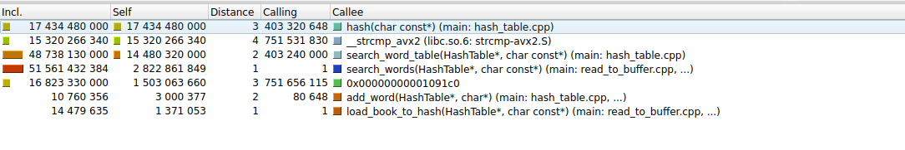
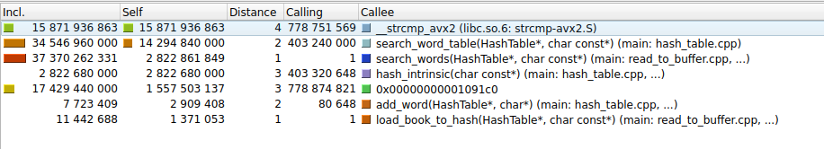
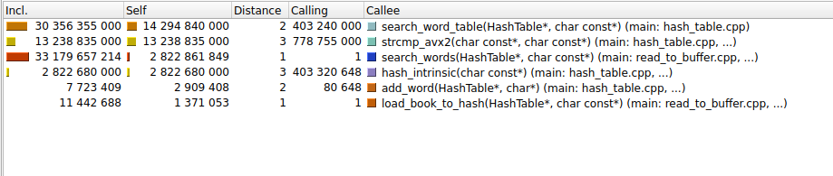
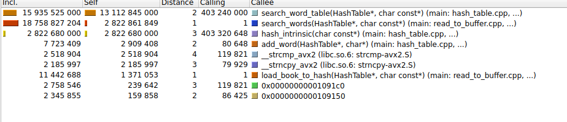

# Оптимизация хэш-таблицы
## 📌 Цель проекта
Разработка и оптимизация хеш-таблицы для строк с анализом эффективности различных хеш-функций и методов оптимизации.

## 🔍 Задачи

Оптимизировать критические функции, используя три метода:

- **Чистый ассемблер** — переписать ключевые части кода на ASM.  
- **Ассемблерные вставки** — точечное внедрение оптимизированных функций.  
- **SIMD-инструкции** — векторизация вычислений (SSE/AVX).  

### Требования к оптимизации:
- Минимизировать объём ассемблерного кода.  
- Рассчитать коэффициент ускорения по формуле:  

Коэффициент улучшения = (Коэффициент ускорения / Количество ассемблерных инструкций) * 1000

## 🗃️ Хеш-таблица — структура данных 
###  🔍 Что это?
**Хеш-таблица** — структура для быстрого доступа к данным по ключу. Работает по принципу:
ключ → хеш-функция → индекс в массиве → значение

## Хеш-таблицы: Методы разрешения коллизий 🚀

В хеш-таблицах коллизии неизбежны. Вот два основных подхода к их разрешению:

▌1. Метод цепочек (Separate Chaining) 🔗

Каждая ячейка массива — это голова связного списка. Когда возникает коллизия, новый элемент просто добавляется в этот список.

Плюсы:

•   Простота реализации.

•   Стабильная производительность даже при высокой нагрузке (заполнении хеш-таблицы).

Минусы:

•   Дополнительная память на указатели для связных списков.

•   Возможные cache misses при доступе к элементам, распределенным по разным участкам памяти.

▌2. Открытая адресация (Open Addressing) 🚪

Все элементы хранятся непосредственно в самом массиве. При коллизии происходит поиск альтернативной ячейки в массиве (например, с помощью линейного или квадратичного probing).

Плюсы:

•   Лучшая локальность данных (все элементы рядом в памяти).

•   Меньше аллокаций памяти (не нужны дополнительные структуры, как связные списки).

Минусы:

•   Чувствительность к высокой нагрузке. Производительность значительно падает при заполнении таблицы более чем на 70%.

•   Более сложные алгоритмы удаления элементов (нужно учитывать, что ячейка могла быть "занята" другим элементом из-за коллизии).


### 📊 Моя реализация:

Хэш-таблица основана на методе цепочек 

Размер таблицы: 5147 бакетов (простое число для равномерности).

Ключи: Строки до 32 символов .

## 🧪 Параметры окружения (WSL)

Все замеры производились в **WSL2 (Ubuntu 22.04)** на Windows 11.

### 🔧 Системные параметры

- **ОС**: Linux DESKTOP-LQJFIVQ 5.15.167.4-microsoft-standard-WSL2 x86_64 GNU/Linux
- **Процессор**: 12th Gen Intel(R) Core(TM) i5-12450H @ 2.60GHz
- **Количество ядер/потоков**: 12
- **Оперативная память (RAM)**: 7.6 GiB
- **Файловая система**: ext4 (на `/dev/sdc`, свободно 951 GB)

Эти параметры обеспечивают стабильное и воспроизводимое окружение для тестирования производительности хэш-таблицы.

### Подготовка слов
Для начала уберем пунктуацию и переведем все буквы в строчные  отдельной программой (папка tools prepare_words.cpp), чтобы замерять именно поиск.

## 🔥 Начнем искать горячие точки

 Воспользуемся valgrind для профилирования :



Выбрав сортировку по Self, увидим, что больше всего тактов (без внутренних вызовов) идет на функцию hash(), ее и будем оптимизировать.
### Первая оптимизация

```c
unsigned long hash(const char *key)
{
    assert(key);

    unsigned long hash = 5381;

    for (size_t i = 0; key[i] != '\0'; i++)

         hash = ((hash << 5) + hash) + (size_t) (key[i]); // hash * 33 + c


    return hash;
}
```

Для ускорения хэш-функции будем использовать  _mm_crc32_u64

```c
uint32_t hash_intrinsic(const char* word)
{
    uint64_t hash = 0;
    hash = _mm_crc32_u64(hash, *((const uint64_t*)(word)));     //process only 4 byte
    hash = _mm_crc32_u64(hash, *((const uint64_t*)(word + 8)));
    hash = _mm_crc32_u64(hash, *((const uint64_t*)(word + 16)));
    hash = _mm_crc32_u64(hash, *((const uint64_t*)(word + 24)));
    return (uint32_t)hash;
}
```
Оценивать коэффициент ускорения будем по тактам работы функции без внутренних вызовов, по тактам работы функции поиска и времени работы функции поиска

🔍 Профилирование с Callgrind


| Функция       | До оптимизации (такты) | После оптимизации (такты) | Ускорение |
|---------------|------------------------|----------------------------|-----------|
| `hash()`      | ~17.4 млрд             | ~2.8 млрд                 | **6.21x** |
| `search_word_table()` | ~48.7 млрд        | ~34.5 млрд                 | **1.41x** |

 ⏱️ Сравнение по времени (clock_gettime)

| Метрика | До оптимизации | После оптимизации | Ускорение |
|---------|----------------|--------------------|-----------|
| **Среднее время** | 1.23 ± 0.04 сек | 0.94 ± 0.01 сек | **1.31x** |


### Вторая оптимизация



Теперь самая долгая strcmp, оптимизируем ее

Заменим библиотечную функцию strcmp на strcmp_avx2, используя интринсики. Для этого в  prepare_words.cpp отсортируем слова по 32 байта, чтобы применить ymm регистры
```c
__attribute__((noinline))

int strcmp_avx2(const char *s1, const char *s2)
{
    assert(s1);
    assert(s2);

    const __m256i *ptr1 = (const __m256i*)s1;
    const __m256i *ptr2 = (const __m256i*)s2;

    __m256i vec1 = _mm256_load_si256(ptr1);
    __m256i vec2 = _mm256_load_si256(ptr2);

    uint32_t mask = _mm256_movemask_epi8(_mm256_cmpeq_epi8(vec1, vec2));
    return (mask == 0xFFFFFFFF) ? 0 : 1;
}

```

🔍 Профилирование с Callgrind

| Функция       | До оптимизации (такты) | После оптимизации (такты) | Ускорение |
|---------------|------------------------|----------------------------|-----------|
| `strcmp()`      | ~15.8 млрд             | ~13.2 млрд                 | **1.19x** |
| `search_word_table()` | ~34.5 млрд          | ~30.4 млрд                  | **1.14x** |


 ⏱️ Сравнение по времени (clock_gettime)


| Метрика | До оптимизации | После оптимизации | Ускорение |
|---------|----------------|--------------------|-----------|
| **Среднее время** | 0.94±0.01 сек | 0.73±0.01 сек | **1.29x** |


### Третья оптимизация



Теперь самая долгая функция int search_word_table (HashTable *table, const char *word), оптимизируем ее интринсиками .
```c

int search_word_table (HashTable *table, const char *word)
{

    assert(table);
    assert(word);

    unsigned long index = hash_intrinsic(word) % table->size;
    HashEntry *entry = table->buckets[index];

    while (entry)
    {
        if (strcmp_avx2(entry->word , word) == 0)
        {

            return entry->count;
        }

        if (entry->next)
            entry = entry->next;
        else
            break;
    }

    return HASH_NOT_FOUND_WORD;

}
```
```c
int search_word_table(HashTable *table, const char *word)
{
    assert(table);
    assert(word);

    unsigned long index = hash_intrinsic(word) % table->size;
    HashEntry *entry = table->buckets[index];

    // Подготавливаем искомое слово
    __m256i target = _mm256_loadu_si256((const __m256i *)word);

    while (entry)
    {
        // Загружаем слово и сравниваем
        __m256i current = _mm256_loadu_si256((const __m256i *)(entry->word));
        __m256i cmp = _mm256_cmpeq_epi8(current, target);
        int mask = _mm256_movemask_epi8(cmp);

        if (mask == 0xFFFFFFFF)
        {
            return entry->count;
        }

        entry = entry->next;
    }

    return HASH_NOT_FOUND_WORD;
}

```

🔍 Профилирование с Callgrind

| Функция       | До оптимизации (инструкции) | После оптимизации (инструкции) | Ускорение |
|---------------|-----------------------------|----------------------------------|-----------|
| `search_word_table()` | ~30.4 млрд             | ~15.9 млрд                      | **1.91x** |

Статистику по Self не будет, так так в Self добавилась функция strcmp_avx2. Анализ будет некорректным


 ⏱️ Сравнение по времени (clock_gettime)

| Метрика | До оптимизации | После оптимизации | Ускорение |
|---------|----------------|--------------------|-----------|
| **Среднее время** | 0.73 ± 0.01 сек | 0.70 ± 0.01 сек | **1.03x** |

Мы достигли желаемых 3х процентов 

### Четвертая оптимизация



