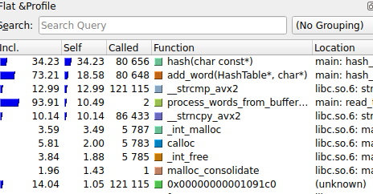

# Оптимизация хэш-таблицы
## Гарри Поттер и философский камень
Частота появления "Harry" - 1327, "Ron" - 429, "Hermione" - 270. Откуда инфоррмация ? - Хэш - таблица нашла:)
## Начнем искать горячие точки
Для начала уберем пунктуацию и переведем все буквы в строчные отдельной программой (папка tools prepare_words.cpp), чтобы замерять именно поиск. Воспользуемся valgrind для анализа

