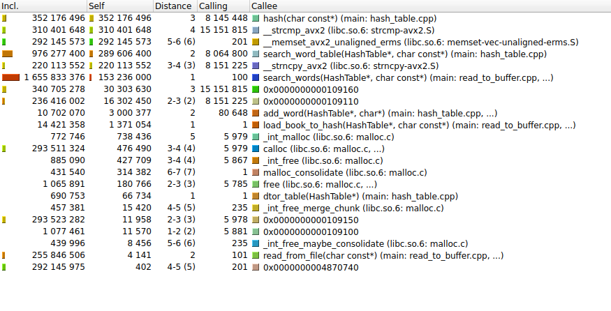
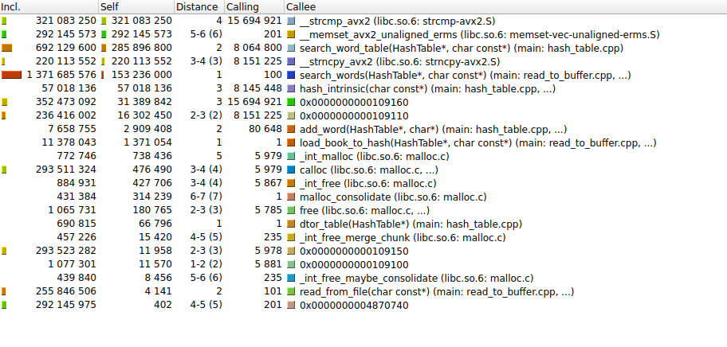

# Оптимизация хэш-таблицы
## 📌 Цель проекта
Разработка и оптимизация хеш-таблицы для строк с анализом эффективности различных хеш-функций и методов оптимизации.

## 🔍 Задачи

Оптимизировать критические функции, используя три метода:

- **Чистый ассемблер** — переписать ключевые части кода на ASM.  
- **Ассемблерные вставки** — точечное внедрение оптимизированных инструкций.  
- **SIMD-инструкции** — векторизация вычислений (SSE/AVX).  

### Требования к оптимизации:
- Минимизировать объём ассемблерного кода.  
- Рассчитать коэффициент ускорения по формуле:  

Коэффициент улучшения = (Коэффициент ускорения / Количество ассемблерных инструкций) * 1000

## 🗃️ Хеш-таблица — структура данных 
###  🔍 Что это?
Хеш-таблица — структура для быстрого доступа к данным по ключу. Работает по принципу:
ключ → хеш-функция → индекс в массиве → значение

## Хеш-таблицы: Методы разрешения коллизий 🚀

В хеш-таблицах коллизии неизбежны. Вот два основных подхода к их разрешению:

▌1. Метод цепочек (Separate Chaining) 🔗

Каждая ячейка массива — это голова связного списка. Когда возникает коллизия, новый элемент просто добавляется в этот список.

Плюсы:

•   Простота реализации.

•   Стабильная производительность даже при высокой нагрузке (заполнении хеш-таблицы).

Минусы:

•   Дополнительная память на указатели для связных списков.

•   Возможные cache misses при доступе к элементам, распределенным по разным участкам памяти.

▌2. Открытая адресация (Open Addressing) 🚪

Все элементы хранятся непосредственно в самом массиве. При коллизии происходит поиск альтернативной ячейки в массиве (например, с помощью линейного или квадратичного probing).

Плюсы:

•   Лучшая локальность данных (все элементы рядом в памяти).

•   Меньше аллокаций памяти (не нужны дополнительные структуры, как связные списки).

Минусы:

•   Чувствительность к высокой нагрузке. Производительность значительно падает при заполнении таблицы более чем на 70%.

•   Более сложные алгоритмы удаления элементов (нужно учитывать, что ячейка могла быть "занята" другим элементом из-за коллизии).


### 📊 Моя реализация:

Хэш-таблица основана на методе цепочек 

Размер таблицы: 5147 бакетов (простое число для равномерности).

Ключи: Строки до 32 символов (WORD_SIZE).

### ⚡ Как работает?

Ключ → Хеш-функция → Индекс в массиве (например, hash("magic") % 5147 → 42).

## 🔥 Начнем искать горячие точки

Для начала уберем пунктуацию и переведем все буквы в строчные и каждое слово записать как 32 байта (намек на ymm) отдельной программой (папка tools prepare_words.cpp), чтобы замерять именно поиск. Воспользуемся valgrind для анализа :



### Первая функция hash 

```c
unsigned long hash(const char *key)
{
    assert(key);

    unsigned long hash = 5381;

    for (size_t i = 0; key[i] != '\0'; i++)

         hash = ((hash << 5) + hash) + (size_t) (key[i]); // hash * 33 + c


    return hash;
}
```

Для ускорения хэш-функции будем использовать  _mm_crc32_u64

```c
uint32_t hash_intrinsic(const char* word)
{
    uint64_t hash = 0;
    hash = _mm_crc32_u64(hash, *((const uint64_t*)(word)));     //process only 4 byte
    hash = _mm_crc32_u64(hash, *((const uint64_t*)(word + 8)));
    hash = _mm_crc32_u64(hash, *((const uint64_t*)(word + 16)));
    hash = _mm_crc32_u64(hash, *((const uint64_t*)(word + 24)));
    return (uint32_t)hash;
}
```




Оценивать коэффициент ускорения будем по Self (такты работы функции без внутренних вызовов)

| Функция       | До оптимизации (такты) | После оптимизации (такты) | Ускорение |
|---------------|-----------------------|--------------------------|-----------|
| `hash()`      | 352 176 496           | 57 018 136               | **6.18×** |

Теперь самая долгая strcmp, оптимизируем ее

### Вторая функция strcmp

Заменим функций из библиотеки на strcmp_avx2, используя интринсики (здесь нам и пригодилось распределение слов по 32 байта )

```c
__attribute__((noinline))

int strcmp_avx2(const char *s1, const char *s2)
{
    assert(s1);
    assert(s2);

    const __m256i *ptr1 = (const __m256i*)s1;
    const __m256i *ptr2 = (const __m256i*)s2;

    __m256i vec1 = _mm256_load_si256(ptr1);
    __m256i vec2 = _mm256_load_si256(ptr2);

    uint32_t mask = _mm256_movemask_epi8(_mm256_cmpeq_epi8(vec1, vec2));
    return (mask == 0xFFFFFFFF) ? 0 : 1;
}

```
Заодно оптимизируем еще одну функции - strncpy. Это позволит нам уменьшить затраты не только на поиск, но и на загрузку.

```c
__attribute__((noinline))
void strncpy_avx2(char *dest, const char *src)
{
    const __m256i *src_vec = (const __m256i*)src;
    __m256i data = _mm256_loadu_si256(src_vec);
    _mm256_storeu_si256((__m256i*)dest, data);

    dest[WORD_SIZE-1] = '\0';
}

```

.png)
